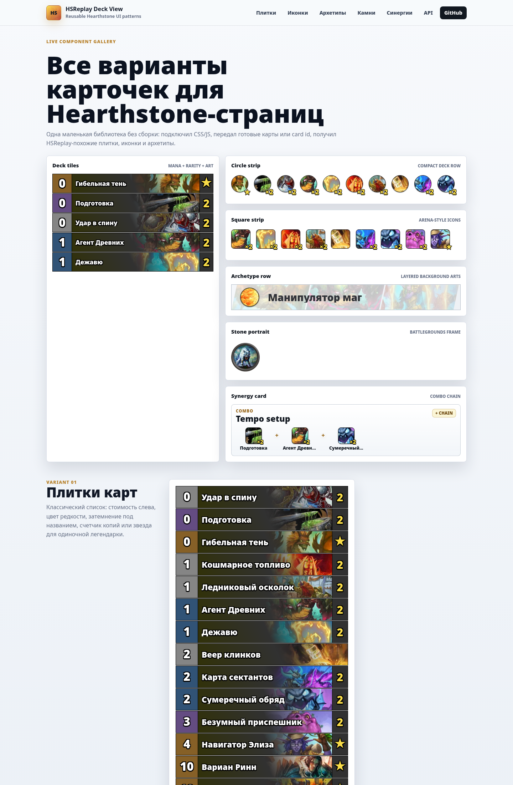
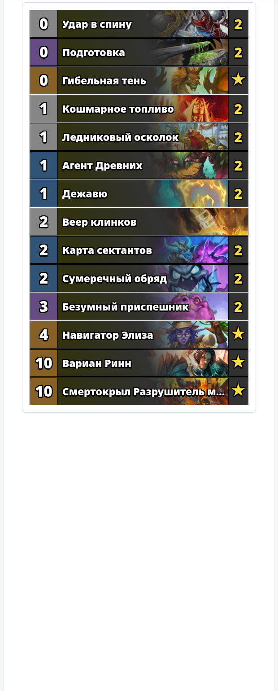
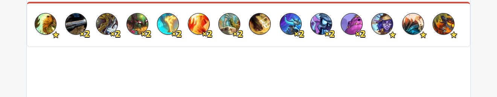
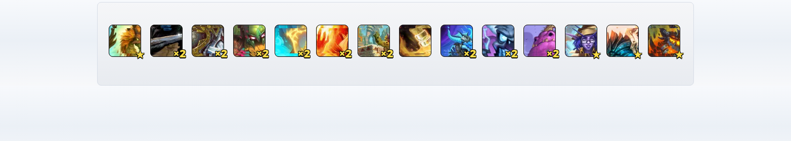
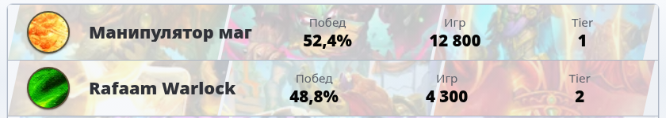
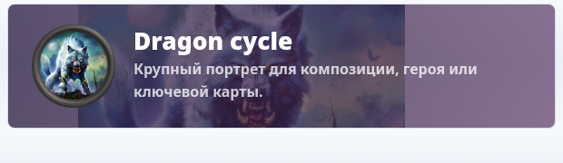
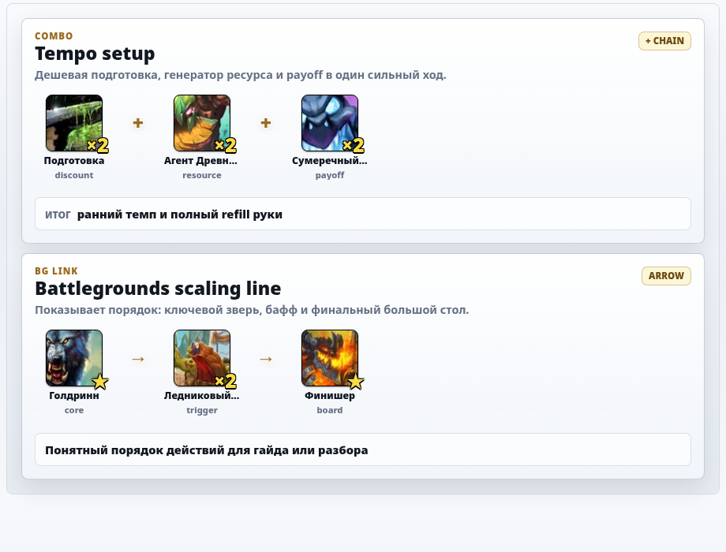
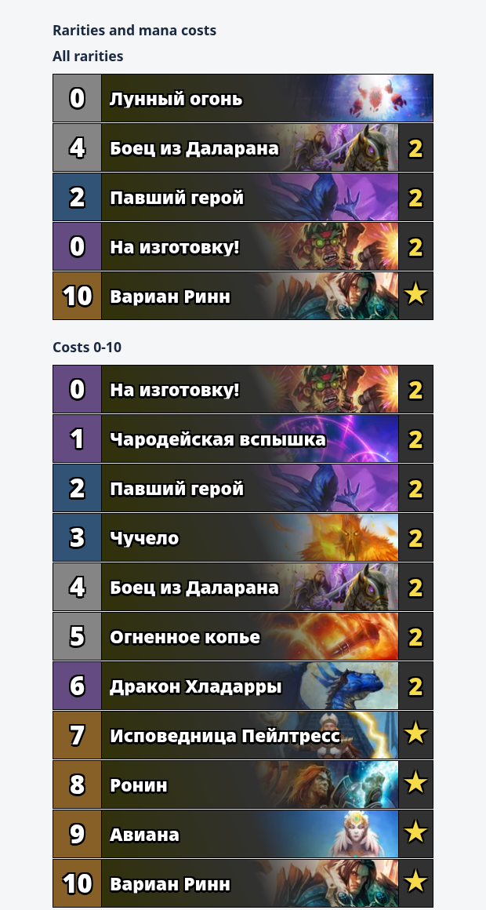
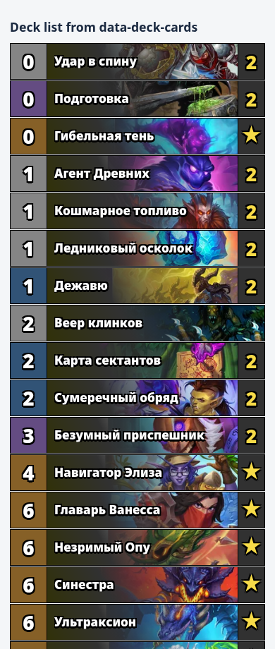

# HSReplay Deck View

Переиспользуемый паттерн Hearthstone-плиток в стиле HSReplay: стоимость слева, цвет редкости, tile-art, затемнение под текстом, название с `ellipsis`, счетчик копий или звезда для легендарок. Также есть компактные режимы круглых/квадратных иконок, строка архетипа с несколькими артами на фоне через диагональные разделители, большой каменный Battlegrounds-портрет и карточка синергии для комбо/BG-связок.

Проект не требует сборки и фреймворков. Достаточно подключить CSS и JS.

## Живая витрина

GitHub Pages: https://zulut30.github.io/hsreplay-deck-view/



## Скриншоты

### Колода из `data-deck-cards`



### Круглые иконки



### Квадратные иконки



### Карточка архетипа



### Каменный портрет



### Карточка синергии



### Все редкости и стоимости 0-10



### Мобильный вид



## Быстрый старт

```html
<link rel="stylesheet" href="src/hsreplay-deck-view.css">
<div id="deck"></div>
<script src="src/hsreplay-deck-view.js"></script>
<script>
  const deckCards = "69521,69521,69623,69623,126088";

  HSReplayDeckView.renderDeckFromDbfIds("#deck", deckCards, {
    locale: "ruRU"
  });
</script>
```

`renderDeckFromDbfIds` берет dbfId, загружает карточную базу HearthstoneJSON, группирует дубликаты, сортирует карты по стоимости и рисует плитки.

## Круглые иконки

Для компактного горизонтального вида используйте тот же источник данных:

```html
<link rel="stylesheet" href="src/hsreplay-deck-view.css">
<div id="deck-icons"></div>
<script src="src/hsreplay-deck-view.js"></script>
<script>
  const deckCards = "69521,69521,69623,69623,126088";

  HSReplayDeckView.renderIconsFromDbfIds("#deck-icons", deckCards, {
    locale: "ruRU"
  });
</script>
```

Круги повторяют HSReplay-паттерн из инспектора: `border-radius: 50%`, `background-position-x: -61.7647px` для размера 30px и `background-size: 111.176px 100%`. В CSS это пересчитано через переменные, поэтому размер можно менять:

```css
#deck-icons .hsrdv {
  --hsrdv-icon-size: 54px;
  --hsrdv-icon-gap: 14px;
}
```

## Квадратные иконки

Третий режим повторяет arena/winning-decks стиль: квадратная иконка, мягкое скругление, белая боковая тень и такой же бейдж количества или легендарной звезды.

```html
<link rel="stylesheet" href="src/hsreplay-deck-view.css">
<div id="deck-squares"></div>
<script src="src/hsreplay-deck-view.js"></script>
<script>
  const deckCards = "69521,69521,69623,69623,126088";

  HSReplayDeckView.renderSquareIconsFromDbfIds("#deck-squares", deckCards, {
    locale: "ruRU"
  });
</script>
```

Размеры из инспектора HSReplay для 36px-иконки: `border-radius: 8px`, `background-position-x: -74.1176px`, `background-size: 133.412px 100%`. В компоненте это тоже пересчитано через переменные:

```css
#deck-squares .hsrdv {
  --hsrdv-square-icon-size: 58px;
  --hsrdv-square-icon-gap: 20px;
}
```

## Карточки архетипов

Этот режим повторяет паттерн из meta overview: строка высотой `70px`, слева круглая иконка архетипа, а под названием лежат несколько `256x`-артов карт. Каждый арт вставляется в параллелограмм с базовой шириной `100px`, сдвигается на `-15px`, отделяется светлым диагональным зазором, получает правый градиент и может растягиваться, чтобы заполнить всю строку.

```html
<link rel="stylesheet" href="src/hsreplay-deck-view.css">
<div id="archetypes"></div>
<script src="src/hsreplay-deck-view.js"></script>
<script>
  HSReplayDeckView.renderArchetypes("#archetypes", [
    {
      name: "Манипулятор маг",
      icon: "CS2_029",
      arts: ["EDR_451", "EDR_852", "EDR_264"]
    }
  ]);
</script>
```

`icon` принимает прямой URL или card id и по умолчанию берет `tiles/{id}.webp`. `arts` принимает card id, прямой URL или объект:

```js
{
  id: "EDR_451",
  position: "center center",
  scale: 1.5,
  opacity: 0.2
}
```

Полезные CSS-переменные:

```css
#archetypes .hsrdv {
  --hsrdv-archetype-height: 70px;
  --hsrdv-archetype-panel-width: 100px;
  --hsrdv-archetype-panel-skew: 15px;
  --hsrdv-archetype-art-opacity: 0.28;
  --hsrdv-archetype-icon-size: 54px;
}
```

## Каменные портреты Battlegrounds

Пятый режим повторяет HSReplay-паттерн из battlegrounds comps: внешний контейнер `80px`, арт карты из `256x/{id}.webp` внутри круглой маски и каменная рамка `minion-frame` поверх изображения через `::before`.

```html
<link rel="stylesheet" href="src/hsreplay-deck-view.css">
<div id="stone-portrait"></div>
<script src="src/hsreplay-deck-view.js"></script>
<script>
  HSReplayDeckView.renderStonePortraits("#stone-portrait", [
    {
      id: "BGS_018",
      name: "Голдринн, Великий волк",
      position: "50% 34%"
    }
  ]);
</script>
```

Полезные CSS-переменные:

```css
#stone-portrait .hsrdv {
  --hsrdv-stone-portrait-size: 80px;
  --hsrdv-stone-portrait-gap: 12px;
  --hsrdv-stone-portrait-art-inset: 8px;
}
```

Если надо подменить рамку на локальную копию:

```js
HSReplayDeckView.renderStonePortraits("#stone-portrait", portraits, {
  stonePortraitFrameImage: "/images/minion-frame.png"
});
```

## Карточки синергий

Карточка синергии нужна для короткого объяснения связки: какие карты/миньоны нужны, в каком порядке они работают и какой результат дают. Это удобно для:

- комбо в гайдах;
- стартовых keep/mulligan-планов;
- Battlegrounds-связок;
- объяснения “ядра” архетипа;
- карточек советов внутри статей или дашбордов.

Компонент поддерживает два типа разделителей:

- `connector: "plus"` рисует `+` между элементами, когда карты работают вместе;
- `connector: "arrow"` рисует `→`, когда важен порядок действий.

```html
<link rel="stylesheet" href="src/hsreplay-deck-view.css">
<div id="synergies"></div>
<script src="src/hsreplay-deck-view.js"></script>
<script>
  HSReplayDeckView.renderSynergies("#synergies", [
    {
      title: "Tempo setup",
      subtitle: "Дешевая подготовка, генератор ресурса и payoff в один сильный ход.",
      eyebrow: "Combo",
      badge: "+ chain",
      connector: "plus",
      items: [
        { id: "CORE_EX1_145", name: "Подготовка", rarity: "EPIC", label: "discount", count: 2 },
        { id: "EDR_852", name: "Агент Древних", rarity: "RARE", label: "resource", count: 2 },
        { id: "TIME_045", name: "Сумеречный обряд", rarity: "RARE", label: "payoff", count: 2 }
      ],
      result: {
        label: "Итог",
        value: "ранний темп и полный refill руки"
      }
    }
  ]);
</script>
```

Пример с порядком действий:

```js
HSReplayDeckView.renderSynergies("#synergies", [
  {
    title: "Battlegrounds scaling line",
    connector: "arrow",
    items: [
      { id: "BGS_018", name: "Голдринн", rarity: "LEGENDARY", elite: true, label: "core" },
      { id: "TLC_835", name: "Триггер", label: "trigger", count: 2 },
      { id: "CATA_190h", name: "Финишер", rarity: "LEGENDARY", elite: true, label: "board" }
    ],
    result: "Понятный порядок действий для гайда или разбора"
  }
]);
```

### Структура объекта синергии

| Поле | Тип | Что делает |
|---|---|---|
| `title` / `name` | string | Главный заголовок карточки |
| `subtitle` / `description` / `text` | string | Короткое объяснение под заголовком |
| `eyebrow` / `type` / `category` | string | Маленькая подпись над заголовком: `Combo`, `BG link`, `Mulligan` |
| `badge` / `tag` | string | Бейдж справа в шапке |
| `connector` | `plus` или `arrow` | Разделитель между элементами: `+` или `→` |
| `items` / `cards` / `minions` / `sequence` | array | Карты/миньоны в цепочке |
| `result` / `outcome` / `payoff` | string или object | Нижний блок результата |
| `url` / `href` | string | Если задан, вся карточка становится ссылкой |
| `label` / `ariaLabel` | string | Доступное имя карточки для скринридеров |

`result` можно передать строкой:

```js
result: "Большой темповый swing"
```

или объектом:

```js
result: {
  label: "Итог",
  value: "ранний темп и полный refill руки"
}
```

### Структура элемента цепочки

| Поле | Тип | Что делает |
|---|---|---|
| `id` / `cardId` | string | Hearthstone card id для картинки |
| `name` / `title` | string | Название под иконкой |
| `label` / `caption` / `role` / `note` | string | Маленькая роль: `discount`, `resource`, `payoff` |
| `rarity` | string | Нужна для внутренней совместимости и будущих цветовых расширений |
| `count` | number | Если больше 1, показывает маленький `×2` бейдж |
| `elite` | boolean | Для одиночной легендарки показывает маленькую `★` |
| `image` / `imageUrl` / `art` / `src` | string | Прямой URL картинки вместо HearthstoneJSON |
| `href` / `url` | string | Если задан, конкретный элемент становится ссылкой |
| `dbfId` | number | Пишется в `data-dbf-id`, если нужен трекинг |
| `predicted` | boolean | Делает элемент полупрозрачным и серым |

Можно передать не объект, а просто строку:

```js
items: ["CORE_EX1_145", "EDR_852", "TIME_045"]
```

Тогда строка трактуется как card id. Если строка выглядит как URL, она используется как прямой image URL.

### CSS-переменные синергий

```css
#synergies .hsrdv {
  --hsrdv-synergy-card-width: 760px;
  --hsrdv-synergy-item-size: 68px;
  --hsrdv-synergy-item-gap: 12px;
  --hsrdv-synergy-connector-size: 34px;
}
```

Что менять чаще всего:

| Переменная | Для чего |
|---|---|
| `--hsrdv-synergy-card-width` | Максимальная ширина карточки |
| `--hsrdv-synergy-item-size` | Размер квадратного арта карты/миньона |
| `--hsrdv-synergy-item-gap` | Расстояние между картой и разделителем |
| `--hsrdv-synergy-connector-size` | Ширина зоны под `+` или `→` |

Если нужен очень компактный вариант для сайдбара:

```css
.sidebar-synergy .hsrdv {
  --hsrdv-synergy-item-size: 52px;
  --hsrdv-synergy-item-gap: 8px;
  --hsrdv-synergy-connector-size: 22px;
}
```

## Готовые объекты карт

Если на сайте уже есть данные карт, можно не грузить HearthstoneJSON:

```html
<div id="manual-deck"></div>
<script>
  HSReplayDeckView.renderDeck("#manual-deck", [
    {
      id: "CATA_190h",
      dbfId: 125467,
      name: "Смертокрыл Разрушитель миров",
      cost: 10,
      rarity: "LEGENDARY",
      elite: true,
      count: 1
    },
    {
      id: "CORE_EX1_145",
      dbfId: 69623,
      name: "Подготовка",
      cost: 0,
      rarity: "EPIC",
      count: 2
    }
  ]);
</script>
```

Минимальные поля:

| Поле | Что делает |
|---|---|
| `id` | Hearthstone card id для tile-art: `https://art.hearthstonejson.com/v1/tiles/{id}.webp` |
| `name` | Текст на плитке |
| `cost` | Стоимость слева |
| `rarity` | `FREE`, `COMMON`, `RARE`, `EPIC`, `LEGENDARY` |
| `count` | Количество копий; `2` рисуется справа |
| `elite` | Для легендарок показывает `★` вместо количества |
| `image` | Необязательный прямой URL арта, если не нужен HearthstoneJSON art CDN |

## API

```js
HSReplayDeckView.renderDeck(target, cards, options)
```

Рендерит массив готовых объектов карт.

```js
HSReplayDeckView.renderDeckFromDbfIds(target, dbfIds, options)
```

Принимает массив dbfId или строку как из HSReplay `data-deck-cards`.

```js
HSReplayDeckView.renderIcons(target, cards, options)
```

Рендерит компактную строку круглых иконок из готовых объектов карт.

```js
HSReplayDeckView.renderIconsFromDbfIds(target, dbfIds, options)
```

Рендерит круглые иконки из массива dbfId или строки `data-deck-cards`.

```js
HSReplayDeckView.renderSquareIcons(target, cards, options)
```

Рендерит компактную строку квадратных иконок из готовых объектов карт.

```js
HSReplayDeckView.renderSquareIconsFromDbfIds(target, dbfIds, options)
```

Рендерит квадратные иконки из массива dbfId или строки `data-deck-cards`.

```js
HSReplayDeckView.renderArchetypes(target, archetypes, options)
```

Рендерит список карточек архетипов из готовых объектов.

```js
HSReplayDeckView.renderStonePortraits(target, portraits, options)
```

Рендерит список больших каменных портретов из готовых объектов, card id или прямых URL изображений.

```js
HSReplayDeckView.renderStonePortraitsFromDbfIds(target, dbfIds, options)
```

Рендерит каменные портреты из массива dbfId или строки. Для Battlegrounds-карт чаще удобнее передавать готовые `id`, потому что стандартный `dataUrl` указывает на collectible JSON.

```js
HSReplayDeckView.renderSynergies(target, synergies, options)
```

Рендерит список карточек синергий. Принимает массив объектов синергий; внутри каждой синергии `items` могут быть объектами, card id или прямыми URL.

```js
HSReplayDeckView.cardsFromDbfIds(dbfIds, options)
```

Возвращает массив карт из HearthstoneJSON без рендера.

```js
HSReplayDeckView.createTile(card, options)
```

Возвращает DOM-элемент одной плитки.

```js
HSReplayDeckView.createIcon(card, options)
```

Возвращает DOM-элемент одной круглой иконки.

```js
HSReplayDeckView.createSquareIcon(card, options)
```

Возвращает DOM-элемент одной квадратной иконки.

```js
HSReplayDeckView.createArchetypeCard(archetype, options)
```

Возвращает DOM-элемент одной карточки архетипа.

```js
HSReplayDeckView.createStonePortrait(portrait, options)
```

Возвращает DOM-элемент одного каменного портрета.

```js
HSReplayDeckView.createSynergyCard(synergy, options)
```

Возвращает DOM-элемент одной карточки синергии.

```js
HSReplayDeckView.createSynergyItem(item, options)
```

Возвращает DOM-элемент одного элемента цепочки внутри карточки синергии.

Основные опции:

| Опция | По умолчанию | Назначение |
|---|---:|---|
| `locale` | `ruRU` | Локаль HearthstoneJSON |
| `dataUrl` | latest collectible JSON | Шаблон URL базы карт, `{locale}` заменяется автоматически |
| `artBaseUrl` | HearthstoneJSON tiles CDN | База URL для артов |
| `artFormat` | `webp` | Формат арта |
| `group` | `true` | Группировать дубликаты в счетчик |
| `sort` | `true` | Сортировать по стоимости, редкости и названию |
| `showLegendaryAsStar` | `true` | Показывать `★` у легендарок |
| `showSingleCountBox` | `false` | Показывать правый счетчик даже для одной копии |
| `iconBadgeSingleCount` | `false` | Показывать `1` на круглых иконках для одиночных нелегендарных карт |
| `archetypeArtBaseUrl` | HearthstoneJSON 256x CDN | База URL для фоновых артов архетипа |
| `archetypeArtFormat` | `webp` | Формат фоновых артов архетипа |
| `archetypeIconBaseUrl` | HearthstoneJSON tiles CDN | База URL для круглой иконки архетипа |
| `archetypeIconFormat` | `webp` | Формат круглой иконки архетипа |
| `stonePortraitArtBaseUrl` | HearthstoneJSON 256x CDN | База URL для арта каменного портрета |
| `stonePortraitArtFormat` | `webp` | Формат арта каменного портрета |
| `stonePortraitFrameImage` | HSReplay minion frame | URL каменной рамки |
| `synergyArtBaseUrl` | HearthstoneJSON tiles CDN | База URL для картинок элементов синергии |
| `synergyArtFormat` | `webp` | Формат картинок элементов синергии |

## HTML-паттерн одной плитки

JS генерирует такую структуру:

```html
<figure class="hsrdv-card-tile">
  <div class="hsrdv-card-gem hsrdv-rarity-legendary">
    <span class="hsrdv-card-cost">10</span>
  </div>
  <div class="hsrdv-card-frame hsrdv-card-frame--with-count">
    
    <div class="hsrdv-card-countbox">
      <span class="hsrdv-card-count">★</span>
    </div>
    <span class="hsrdv-card-fade"></span>
    <figcaption class="hsrdv-card-name">Смертокрыл Разрушитель миров</figcaption>
  </div>
</figure>
```

Классы специально префиксованы `hsrdv-`, чтобы этот компонент было проще вставлять на другие сайты без конфликта с их CSS.

## HTML-паттерн круглой иконки

```html
<ul class="hsrdv-icon-list">
  <li>
    <div
      class="hsrdv-card-icon hsrdv-rarity-epic"
      role="img"
      aria-label="Подготовка ×2"
      style="background-image: url(&quot;https://art.hearthstonejson.com/v1/tiles/CORE_EX1_145.webp&quot;)"
    >
      <span class="hsrdv-card-icon-badge hsrdv-card-icon-badge--copies">×2</span>
    </div>
  </li>
</ul>
```

## HTML-паттерн квадратной иконки

```html
<ul class="hsrdv-square-icon-list">
  <li>
    <div
      class="hsrdv-card-square-icon hsrdv-rarity-legendary"
      role="img"
      aria-label="Навигатор Элиза ★"
      style="background-image: url(&quot;https://art.hearthstonejson.com/v1/tiles/TLC_100.webp&quot;)"
    >
      <span class="hsrdv-card-square-badge hsrdv-card-square-badge--star">★</span>
    </div>
  </li>
</ul>
```

## HTML-паттерн карточки архетипа

```html
<ul class="hsrdv-archetype-list">
  <li>
    <article class="hsrdv-archetype-card" aria-label="Манипулятор маг">
      <div class="hsrdv-archetype-bg" aria-hidden="true">
        <span class="hsrdv-archetype-art-panel">
          <span
            class="hsrdv-archetype-art"
            style="background-image: url(&quot;https://art.hearthstonejson.com/v1/256x/EDR_451.webp&quot;)"
          ></span>
        </span>
        <span class="hsrdv-archetype-art-panel">
          <span
            class="hsrdv-archetype-art"
            style="background-image: url(&quot;https://art.hearthstonejson.com/v1/256x/EDR_852.webp&quot;)"
          ></span>
        </span>
      </div>
      <div class="hsrdv-archetype-content">
        
        <h3 class="hsrdv-archetype-title">Манипулятор маг</h3>
      </div>
    </article>
  </li>
</ul>
```

## HTML-паттерн каменного портрета

```html
<ul class="hsrdv-stone-portrait-list">
  <li>
    <div class="hsrdv-stone-portrait" aria-label="Голдринн, Великий волк" data-card-id="BGS_018">
      
    </div>
  </li>
</ul>
```

Каменная рамка живет в `.hsrdv-stone-portrait::before`, поэтому DOM остается легким: контейнер + один `img`.

## HTML-паттерн карточки синергии

```html
<ul class="hsrdv-synergy-list">
  <li>
    <article class="hsrdv-synergy-card hsrdv-synergy-card--plus" aria-label="Tempo setup">
      <header class="hsrdv-synergy-header">
        <div class="hsrdv-synergy-title-group">
          <span class="hsrdv-synergy-eyebrow">Combo</span>
          <h3 class="hsrdv-synergy-title">Tempo setup</h3>
          <p class="hsrdv-synergy-subtitle">Дешевая подготовка, генератор ресурса и payoff.</p>
        </div>
        <span class="hsrdv-synergy-card-badge">+ chain</span>
      </header>

      <ol class="hsrdv-synergy-chain">
        <li class="hsrdv-synergy-chain-item">
          <div class="hsrdv-synergy-item hsrdv-rarity-epic" aria-label="Подготовка, discount">
            <span class="hsrdv-synergy-artbox">
              <span
                class="hsrdv-synergy-art"
                style="background-image: url(&quot;https://art.hearthstonejson.com/v1/tiles/CORE_EX1_145.webp&quot;)"
              ></span>
              <span class="hsrdv-synergy-badge hsrdv-synergy-badge--copies">×2</span>
            </span>
            <span class="hsrdv-synergy-name">Подготовка</span>
            <span class="hsrdv-synergy-label">discount</span>
          </div>
        </li>

        <li class="hsrdv-synergy-connector" aria-hidden="true"><span>+</span></li>

        <li class="hsrdv-synergy-chain-item">
          <div class="hsrdv-synergy-item hsrdv-rarity-rare" aria-label="Агент Древних, resource">
            <span class="hsrdv-synergy-artbox">
              <span
                class="hsrdv-synergy-art"
                style="background-image: url(&quot;https://art.hearthstonejson.com/v1/tiles/EDR_852.webp&quot;)"
              ></span>
              <span class="hsrdv-synergy-badge hsrdv-synergy-badge--copies">×2</span>
            </span>
            <span class="hsrdv-synergy-name">Агент Древних</span>
            <span class="hsrdv-synergy-label">resource</span>
          </div>
        </li>
      </ol>

      <div class="hsrdv-synergy-result">
        <span class="hsrdv-synergy-result-label">Итог</span>
        <strong>ранний темп и полный refill руки</strong>
      </div>
    </article>
  </li>
</ul>
```

Классы цепочки намеренно отдельные от обычных квадратных иконок. Так можно независимо менять размер синергии, не ломая `renderSquareIcons`.

## Демо и скриншоты

Открыть локально:

```bash
npm run serve
```

После этого перейти на `http://127.0.0.1:8080/`.

Пересобрать скриншоты для README:

```bash
npm run screenshots
```

Скрипт использует установленный Chromium. Если бинарник называется иначе, можно указать его явно:

```bash
CHROMIUM_BIN=/path/to/chromium npm run screenshots
```

## GitHub Pages

Живая витрина опубликована на GitHub Pages:

https://zulut30.github.io/hsreplay-deck-view/

Сейчас деплой идет из ветки `gh-pages`. После правок в `main` обновить Pages можно так:

```bash
git push origin main:gh-pages
```

Локально сайт можно открыть через:

```bash
npm run serve
```

## Источники данных

- Данные карт: `https://api.hearthstonejson.com/v1/latest/{locale}/cards.collectible.json`
- Tile-art: `https://art.hearthstonejson.com/v1/tiles/{cardId}.webp`
- Full art для архетипов и каменных портретов: `https://art.hearthstonejson.com/v1/256x/{cardId}.webp`
- Каменная рамка: `https://static.hsreplay.net/static/webpack/assets/images/battlegrounds/minion-frame.d21732172d83faeae997.png`

Для сайтов, где нельзя зависеть от внешних CDN, передавайте свои поля `image` и готовые данные карт в `renderDeck`, для архетипов используйте прямые URL в `icon` и `arts`, для каменных портретов подменяйте `stonePortraitFrameImage`, а для синергий передавайте прямые URL в `items[].image`.
