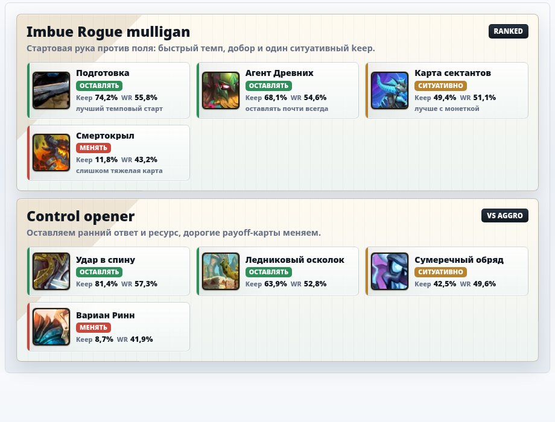
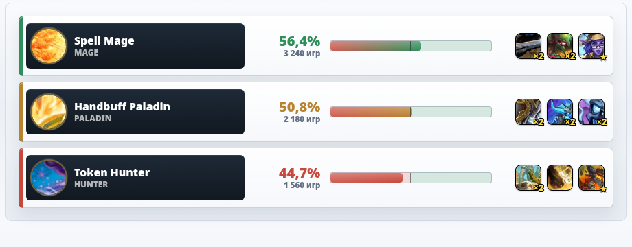
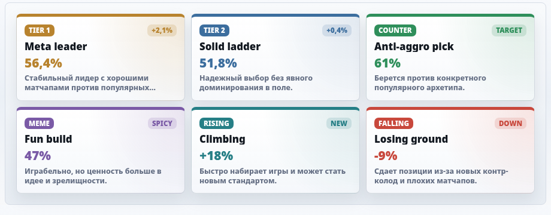
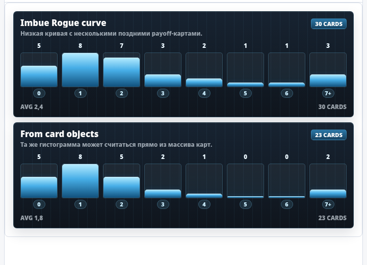
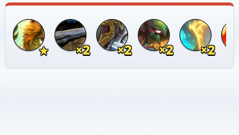
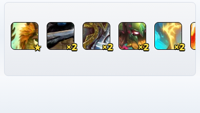
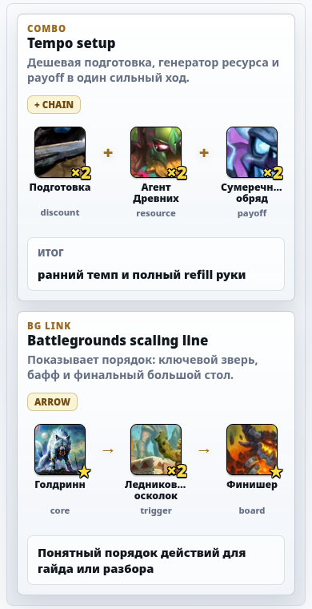

# HSReplay Deck View

Переиспользуемый паттерн Hearthstone-плиток в стиле HSReplay: стоимость слева, цвет редкости, tile-art, затемнение под текстом, название с `ellipsis`, счетчик копий или звезда для легендарок. Также есть компактные режимы круглых/квадратных иконок, строка архетипа с несколькими артами на фоне через диагональные разделители, большой каменный Battlegrounds-портрет, карточка синергии для комбо/BG-связок, mulligan card, matchup row, tier/meta badges и deck cost curve.

Проект не требует сборки и фреймворков. Достаточно подключить CSS и JS. Для React/TypeScript/Next.js добавлен `src/hsreplay-deck-view.d.ts`, а для LLM и дизайнерских правок есть отдельный [DESIGN.md](DESIGN.md).

## Живая витрина

GitHub Pages: https://zulut30.github.io/hsreplay-deck-view/


## Скриншоты

### Колода из `data-deck-cards`


### Круглые иконки


### Квадратные иконки


### Карточка архетипа


### Каменный портрет


### Карточка синергии


### Mulligan card



### Matchup row



### Tier/meta badge



### Deck cost curve



### Все редкости и стоимости 0-10


### Мобильный вид


### Мобильные круглые иконки



### Мобильные квадратные иконки



### Мобильная карточка синергии



## Быстрый старт

```html
<link rel="stylesheet" href="src/hsreplay-deck-view.css">
<div id="deck"></div>
<script src="src/hsreplay-deck-view.js"></script>
<script>
  const deckCards = "69521,69521,69623,69623,126088";

  HSReplayDeckView.renderDeckFromDbfIds("#deck", deckCards, {
    locale: "ruRU"
  });
</script>
```

`renderDeckFromDbfIds` берет dbfId, загружает карточную базу HearthstoneJSON, группирует дубликаты, сортирует карты по стоимости и рисует плитки.

## Совместимость

| Среда | Статус | Как подключать |
|---|---|---|
| Plain HTML / WordPress / Yii2 / PHP-шаблоны | Полная | Подключить `src/hsreplay-deck-view.css` и `src/hsreplay-deck-view.js` через `<link>`/`<script>` |
| React | Полная на клиенте | Рендерить в `ref` внутри `useEffect`; компонент сам управляет DOM внутри контейнера |
| TypeScript | Типизировано | Использовать `src/hsreplay-deck-view.d.ts` или package `types` |
| Next.js App Router | Полная в client component | Подключать JS через `next/script` или динамически в `useEffect`; не вызывать render-методы во время SSR |
| Node.js | Частичная | Data helpers работают в Node 18+; DOM-render методы требуют `document` или JSDOM |

Важно: все `render*` методы создают реальные DOM-элементы через `document.createElement`. Поэтому в SSR/Node без DOM нужно либо вызывать только data helpers (`parseDeckCards`, `cardsFromDbfIds`, `groupCards`, `sortCards`, `normalize*`), либо дать DOM через JSDOM.

### React + TypeScript

```tsx
import { useEffect, useRef } from "react";
import type HSReplayDeckView = require("hsreplay-deck-view");
import "hsreplay-deck-view/css";

type Card = HSReplayDeckView.Card;

export function DeckTiles({ cards }: { cards: Card[] }) {
  const ref = useRef<HTMLDivElement | null>(null);

  useEffect(() => {
    if (!ref.current) return;

    const api = window.HSReplayDeckView;
    api.renderDeck(ref.current, cards, {
      className: "my-deck-tiles",
      clear: true
    });

    return () => ref.current?.replaceChildren();
  }, [cards]);

  return <div ref={ref} />;
}
```

Если библиотека подключается не как npm-пакет, а локальными файлами из `public/vendor`, добавьте reference к типам:

```ts
/// <reference path="../public/vendor/hsreplay-deck-view.d.ts" />
```

и используйте глобальный тип:

```ts
const api: HSReplayDeckView.Api = window.HSReplayDeckView;
```

### Next.js App Router

В Next.js все визуальные компоненты должны жить в client component, потому что библиотека работает с DOM.

```tsx
"use client";

import Script from "next/script";
import { useEffect, useRef, useState } from "react";
import "./hsreplay-deck-view.css";

export function DeckCurve({ cards }: { cards: HSReplayDeckView.Card[] }) {
  const ref = useRef<HTMLDivElement | null>(null);
  const [ready, setReady] = useState(false);

  useEffect(() => {
    if (!ready || !ref.current) return;
    window.HSReplayDeckView.renderCostCurve(ref.current, cards, {
      className: "deck-card-curve"
    });
  }, [ready, cards]);

  return (
    <>
      <Script
        src="/vendor/hsreplay-deck-view.js"
        strategy="afterInteractive"
        onLoad={() => setReady(true)}
      />
      <div ref={ref} />
    </>
  );
}
```

Практичный вариант для Next.js:

- положить `hsreplay-deck-view.js`, `hsreplay-deck-view.css`, `hsreplay-deck-view.d.ts` в `public/vendor/`;
- подключать CSS глобально в `app/layout.tsx` или рядом с client component;
- не импортировать JS-файл в server component;
- не вызывать `render*` до загрузки `<Script>`.

### Node.js

В Node.js можно использовать CommonJS entry point:

```js
const HSReplayDeckView = require("./src/hsreplay-deck-view.js");

const cards = HSReplayDeckView.groupCards([
  { id: "CORE_EX1_145", name: "Подготовка", cost: 0, count: 2 },
  { id: "CATA_190h", name: "Смертокрыл", cost: 10, count: 1 }
]);

console.log(cards);
```

Для `cardsFromDbfIds` нужен `fetch`; в Node 18+ он есть из коробки. Для `renderDeck`, `createTile`, `renderCostCurve` и других DOM-методов нужен browser DOM или JSDOM:

```js
const { JSDOM } = require("jsdom");
const HSReplayDeckView = require("./src/hsreplay-deck-view.js");

const dom = new JSDOM('<div id="deck"></div>');
global.document = dom.window.document;

HSReplayDeckView.renderDeck("#deck", cards);
console.log(dom.window.document.body.innerHTML);
```

## Адаптация под уникальный дизайн

Компоненты специально разделены на API, HTML-паттерн и CSS-классы с префиксом `hsrdv-`. Их можно глубоко менять под другой сайт без переписывания JS.

Рекомендуемый порядок кастомизации:

1. Передать `className` в render-метод и скоупить дизайн от него.
2. Сначала менять CSS-переменные: размеры, gap, ширину, высоту, opacity.
3. Потом переопределять конкретные классы компонента внутри своей темы.
4. Для сложной темы менять фон/рамки/теневые акценты, но сохранять DOM-классы и aria/data-атрибуты.
5. Для другого CDN или локальных картинок передавать `image`, `imageUrl`, `art`, `icon`, `arts`, `stonePortraitFrameImage`.
6. Для маленьких круглых/квадратных кропов задавать фокус арта через `position`, `focusX/focusY` или `scale`.

Пример скоупа под свой сайт:

```css
.my-meta-page .hsrdv {
  --hsrdv-icon-size: 46px;
  --hsrdv-meta-badge-width: 100%;
  --hsrdv-cost-curve-height: 116px;
}

.my-meta-page .hsrdv-meta-badge {
  border-radius: 4px;
  background:
    linear-gradient(90deg, rgb(0 0 0 / 34%), rgb(0 0 0 / 12%)),
    var(--my-deck-panel);
}

.my-meta-page .hsrdv-cost-curve-fill {
  background: linear-gradient(180deg, #fff2a8, #c98928 56%, #6e4211);
}
```

Для LLM-доработок и сложных дизайн-систем используйте [DESIGN.md](DESIGN.md): там описаны границы компонентов, что можно менять, что нельзя ломать, какие классы являются контрактом и как проверять результат.

## Круглые иконки

Для компактного горизонтального вида используйте тот же источник данных:

```html
<link rel="stylesheet" href="src/hsreplay-deck-view.css">
<div id="deck-icons"></div>
<script src="src/hsreplay-deck-view.js"></script>
<script>
  const deckCards = "69521,69521,69623,69623,126088";

  HSReplayDeckView.renderIconsFromDbfIds("#deck-icons", deckCards, {
    locale: "ruRU"
  });
</script>
```

Круги повторяют HSReplay-паттерн из инспектора: `border-radius: 50%`, tile-art как `background-image`, маленький бейдж `×2` или `★` поверх рамки. По умолчанию кроп смещен ближе к центру арта, чтобы в маленьком круге чаще было видно главный объект карты:

```css
#deck-icons .hsrdv {
  --hsrdv-icon-size: 54px;
  --hsrdv-icon-gap: 14px;
  --hsrdv-icon-art-position: 58% center;
  --hsrdv-icon-art-background-size: auto 100%;
}
```

### Фокус арта в маленьких иконках

Tile-art у HearthstoneJSON широкий, а круглая/квадратная иконка маленькая. Поэтому один общий кроп не всегда попадает в лицо, оружие или главный объект карты. Компонент поддерживает ручную настройку на уровне каждой карты:

```js
HSReplayDeckView.renderIcons("#deck-icons", [
  {
    id: "CORE_EX1_145",
    name: "Подготовка",
    cost: 0,
    rarity: "EPIC",
    count: 2,
    position: "48% center"
  },
  {
    id: "BGS_018",
    name: "Голдринн",
    rarity: "LEGENDARY",
    elite: true,
    image: "https://art.hearthstonejson.com/v1/256x/BGS_018.webp",
    focusX: 50,
    focusY: 35,
    scale: 1.08
  }
]);
```

Поддерживаемые поля:

| Поле | Пример | Что делает |
|---|---|---|
| `position` / `artPosition` / `backgroundPosition` | `"58% center"` | Напрямую задает `background-position` |
| `focusX` + `focusY` | `50`, `35` | Собираются в позицию `"50% 35%"` |
| `focus: { x, y }` | `{ x: 52, y: 42 }` | То же самое, но одним объектом |
| `scale` / `artScale` / `zoom` | `1.08` | Делает `background-size: auto 108%` |
| `backgroundSize` / `artSize` | `"auto 120%"` | Полный ручной контроль `background-size` |

Тот же фокус работает в `renderSquareIcons`, `renderSynergies`, `renderMulligans` и маленьких картах `renderMatchups`.

### Мобильная адаптация

В базовом CSS есть breakpoint `max-width: 520px`. На нем:

- плитки колоды становятся ниже и сохраняют читаемую стоимость/счетчик;
- круглые и квадратные иконки становятся крупнее, выравниваются от левого края и прокручиваются горизонтально;
- карточки синергий сохраняют крупный арт, но подписи могут переноситься на две строки;
- mulligan/meta блоки переходят в одну колонку;
- matchup row складывается в вертикальную строку: противник, winrate, шкала, ключевые карты.

Для сайта с собственной сеткой обычно достаточно обернуть компонент и задать переменные:

```css
.article-deck-widget .hsrdv {
  --hsrdv-icon-size: 50px;
  --hsrdv-square-icon-size: 54px;
  --hsrdv-synergy-card-width: 100%;
}

@media (max-width: 520px) {
  .article-deck-widget .hsrdv {
    --hsrdv-icon-size: 46px;
    --hsrdv-square-icon-size: 48px;
    --hsrdv-synergy-item-size: 62px;
  }
}
```

## Квадратные иконки

Третий режим повторяет arena/winning-decks стиль: квадратная иконка, мягкое скругление, белая боковая тень и такой же бейдж количества или легендарной звезды.

```html
<link rel="stylesheet" href="src/hsreplay-deck-view.css">
<div id="deck-squares"></div>
<script src="src/hsreplay-deck-view.js"></script>
<script>
  const deckCards = "69521,69521,69623,69623,126088";

  HSReplayDeckView.renderSquareIconsFromDbfIds("#deck-squares", deckCards, {
    locale: "ruRU"
  });
</script>
```

Базовый квадрат использует `border-radius: 8px`, маленькую темную рамку, белую боковую тень и тот же фокус арта, что круглые иконки. Глобальный кроп можно менять переменными:

```css
#deck-squares .hsrdv {
  --hsrdv-square-icon-size: 58px;
  --hsrdv-square-icon-gap: 20px;
  --hsrdv-square-art-position: 56% center;
  --hsrdv-square-art-background-size: auto 104%;
}
```

## Карточки архетипов

Этот режим повторяет паттерн из meta overview: строка высотой `70px`, слева круглая иконка архетипа, а под названием лежат несколько `256x`-артов карт. Каждый арт вставляется в параллелограмм с базовой шириной `100px`, сдвигается на `-15px`, отделяется светлым диагональным зазором, получает правый градиент и может растягиваться, чтобы заполнить всю строку.

```html
<link rel="stylesheet" href="src/hsreplay-deck-view.css">
<div id="archetypes"></div>
<script src="src/hsreplay-deck-view.js"></script>
<script>
  HSReplayDeckView.renderArchetypes("#archetypes", [
    {
      name: "Манипулятор маг",
      icon: "CS2_029",
      arts: ["EDR_451", "EDR_852", "EDR_264"]
    }
  ]);
</script>
```

`icon` принимает прямой URL или card id и по умолчанию берет `tiles/{id}.webp`. `arts` принимает card id, прямой URL или объект:

```js
{
  id: "EDR_451",
  position: "center center",
  scale: 1.5,
  opacity: 0.2
}
```

Полезные CSS-переменные:

```css
#archetypes .hsrdv {
  --hsrdv-archetype-height: 70px;
  --hsrdv-archetype-panel-width: 100px;
  --hsrdv-archetype-panel-skew: 15px;
  --hsrdv-archetype-art-opacity: 0.28;
  --hsrdv-archetype-icon-size: 54px;
}
```

## Каменные портреты Battlegrounds

Пятый режим повторяет HSReplay-паттерн из battlegrounds comps: внешний контейнер `80px`, арт карты из `256x/{id}.webp` внутри круглой маски и каменная рамка `minion-frame` поверх изображения через `::before`.

```html
<link rel="stylesheet" href="src/hsreplay-deck-view.css">
<div id="stone-portrait"></div>
<script src="src/hsreplay-deck-view.js"></script>
<script>
  HSReplayDeckView.renderStonePortraits("#stone-portrait", [
    {
      id: "BGS_018",
      name: "Голдринн, Великий волк",
      position: "50% 34%"
    }
  ]);
</script>
```

Полезные CSS-переменные:

```css
#stone-portrait .hsrdv {
  --hsrdv-stone-portrait-size: 80px;
  --hsrdv-stone-portrait-gap: 12px;
  --hsrdv-stone-portrait-art-inset: 8px;
}
```

Если надо подменить рамку на локальную копию:

```js
HSReplayDeckView.renderStonePortraits("#stone-portrait", portraits, {
  stonePortraitFrameImage: "/images/minion-frame.png"
});
```

## Карточки синергий

Карточка синергии нужна для короткого объяснения связки: какие карты/миньоны нужны, в каком порядке они работают и какой результат дают. Это удобно для:

- комбо в гайдах;
- стартовых keep/mulligan-планов;
- Battlegrounds-связок;
- объяснения “ядра” архетипа;
- карточек советов внутри статей или дашбордов.

Компонент поддерживает два типа разделителей:

- `connector: "plus"` рисует `+` между элементами, когда карты работают вместе;
- `connector: "arrow"` рисует `→`, когда важен порядок действий.

```html
<link rel="stylesheet" href="src/hsreplay-deck-view.css">
<div id="synergies"></div>
<script src="src/hsreplay-deck-view.js"></script>
<script>
  HSReplayDeckView.renderSynergies("#synergies", [
    {
      title: "Tempo setup",
      subtitle: "Дешевая подготовка, генератор ресурса и payoff в один сильный ход.",
      eyebrow: "Combo",
      badge: "+ chain",
      connector: "plus",
      items: [
        { id: "CORE_EX1_145", name: "Подготовка", rarity: "EPIC", label: "discount", count: 2 },
        { id: "EDR_852", name: "Агент Древних", rarity: "RARE", label: "resource", count: 2 },
        { id: "TIME_045", name: "Сумеречный обряд", rarity: "RARE", label: "payoff", count: 2 }
      ],
      result: {
        label: "Итог",
        value: "ранний темп и полный refill руки"
      }
    }
  ]);
</script>
```

Пример с порядком действий:

```js
HSReplayDeckView.renderSynergies("#synergies", [
  {
    title: "Battlegrounds scaling line",
    connector: "arrow",
    items: [
      { id: "BGS_018", name: "Голдринн", rarity: "LEGENDARY", elite: true, label: "core" },
      { id: "TLC_835", name: "Триггер", label: "trigger", count: 2 },
      { id: "CATA_190h", name: "Финишер", rarity: "LEGENDARY", elite: true, label: "board" }
    ],
    result: "Понятный порядок действий для гайда или разбора"
  }
]);
```

### Структура объекта синергии

| Поле | Тип | Что делает |
|---|---|---|
| `title` / `name` | string | Главный заголовок карточки |
| `subtitle` / `description` / `text` | string | Короткое объяснение под заголовком |
| `eyebrow` / `type` / `category` | string | Маленькая подпись над заголовком: `Combo`, `BG link`, `Mulligan` |
| `badge` / `tag` | string | Бейдж справа в шапке |
| `connector` | `plus` или `arrow` | Разделитель между элементами: `+` или `→` |
| `items` / `cards` / `minions` / `sequence` | array | Карты/миньоны в цепочке |
| `result` / `outcome` / `payoff` | string или object | Нижний блок результата |
| `url` / `href` | string | Если задан, вся карточка становится ссылкой |
| `label` / `ariaLabel` | string | Доступное имя карточки для скринридеров |

`result` можно передать строкой:

```js
result: "Большой темповый swing"
```

или объектом:

```js
result: {
  label: "Итог",
  value: "ранний темп и полный refill руки"
}
```

### Структура элемента цепочки

| Поле | Тип | Что делает |
|---|---|---|
| `id` / `cardId` | string | Hearthstone card id для картинки |
| `name` / `title` | string | Название под иконкой |
| `label` / `caption` / `role` / `note` | string | Маленькая роль: `discount`, `resource`, `payoff` |
| `rarity` | string | Нужна для внутренней совместимости и будущих цветовых расширений |
| `count` | number | Если больше 1, показывает маленький `×2` бейдж |
| `elite` | boolean | Для одиночной легендарки показывает маленькую `★` |
| `image` / `imageUrl` / `art` / `src` | string | Прямой URL картинки вместо HearthstoneJSON |
| `href` / `url` | string | Если задан, конкретный элемент становится ссылкой |
| `dbfId` | number | Пишется в `data-dbf-id`, если нужен трекинг |
| `predicted` | boolean | Делает элемент полупрозрачным и серым |
| `position` / `focusX` / `focusY` / `scale` | string/number | Ручной фокус и масштаб маленького арта |

Можно передать не объект, а просто строку:

```js
items: ["CORE_EX1_145", "EDR_852", "TIME_045"]
```

Тогда строка трактуется как card id. Если строка выглядит как URL, она используется как прямой image URL.

### CSS-переменные синергий

```css
#synergies .hsrdv {
  --hsrdv-synergy-card-width: 760px;
  --hsrdv-synergy-item-size: 68px;
  --hsrdv-synergy-item-gap: 12px;
  --hsrdv-synergy-connector-size: 34px;
}
```

Что менять чаще всего:

| Переменная | Для чего |
|---|---|
| `--hsrdv-synergy-card-width` | Максимальная ширина карточки |
| `--hsrdv-synergy-item-size` | Размер квадратного арта карты/миньона |
| `--hsrdv-synergy-item-gap` | Расстояние между картой и разделителем |
| `--hsrdv-synergy-connector-size` | Ширина зоны под `+` или `→` |

Если нужен очень компактный вариант для сайдбара:

```css
.sidebar-synergy .hsrdv {
  --hsrdv-synergy-item-size: 52px;
  --hsrdv-synergy-item-gap: 8px;
  --hsrdv-synergy-connector-size: 22px;
}
```

## Mulligan card

Карточка mulligan показывает 3-4 карты стартовой руки, проценты keep/winrate и цветовой статус решения:

- `keep` / `оставлять` — зеленый статус для карт, которые почти всегда хочется оставить;
- `situational` / `ситуативно` — желтый статус для карт под монетку, матчап или уже найденную связку;
- `replace` / `менять` — красный статус для карт, которые чаще нужно возвращать.

```html
<link rel="stylesheet" href="src/hsreplay-deck-view.css">
<div id="mulligan"></div>
<script src="src/hsreplay-deck-view.js"></script>
<script>
  HSReplayDeckView.renderMulligans("#mulligan", [
    {
      title: "Imbue Rogue mulligan",
      subtitle: "Стартовая рука против поля: быстрый темп, добор и один ситуативный keep.",
      badge: "ranked",
      cards: [
        { id: "CORE_EX1_145", name: "Подготовка", rarity: "EPIC", keepRate: 74.2, winrate: 55.8, status: "keep", note: "лучший темповый старт" },
        { id: "EDR_852", name: "Агент Древних", rarity: "RARE", keepRate: 68.1, winrate: 54.6, status: "keep" },
        { id: "END_020", name: "Карта сектантов", rarity: "RARE", keepRate: 49.4, winrate: 51.1, status: "situational", note: "лучше с монеткой" },
        { id: "CATA_190h", name: "Смертокрыл", rarity: "LEGENDARY", keepRate: 11.8, winrate: 43.2, status: "replace" }
      ]
    }
  ]);
</script>
```

### Структура объекта mulligan

| Поле | Тип | Что делает |
|---|---|---|
| `title` / `name` | string | Заголовок карточки |
| `subtitle` / `description` / `text` | string | Короткое пояснение под заголовком |
| `badge` / `tag` / `context` | string | Бейдж справа: `ranked`, `vs aggro`, `on coin` |
| `cards` / `items` / `hand` / `cardIds` | array | Карты стартовой руки |
| `url` / `href` | string | Если задан, вся карточка становится ссылкой |

### Структура карты mulligan

| Поле | Тип | Что делает |
|---|---|---|
| `id` / `cardId` | string | Hearthstone card id для `tiles/{id}.webp` |
| `name` / `title` / `cardName` | string | Название карты |
| `rarity` | string | Цветовой класс редкости |
| `keepRate` / `keep` / `keepPercent` | number/string | Процент keep |
| `winrate` / `winRate` / `wr` | number/string | Winrate при keep |
| `status` / `decision` / `state` | string | `keep`, `situational`, `replace` или русские варианты |
| `note` / `reason` / `caption` | string | Маленькая подпись под метриками |
| `image` / `imageUrl` / `art` / `src` | string | Прямой URL картинки |
| `href` / `url` | string | Если задан, отдельная карта становится ссылкой |
| `position` / `focusX` / `focusY` / `scale` | string/number | Ручной фокус и масштаб маленького арта |

Если `status` не передан, компонент сам оценит его по `keepRate`: примерно `62%+` как `keep`, `45-61%` как `situational`, ниже как `replace`.

Полезные CSS-переменные:

```css
#mulligan .hsrdv {
  --hsrdv-mulligan-card-width: 760px;
  --hsrdv-mulligan-art-size: 60px;
  --hsrdv-mulligan-gap: 10px;
}
```

## Matchup row

Matchup row нужен для мета-таблиц и страниц архетипов: слева противник, рядом winrate и шкала преимущества, справа маленькие ключевые карты.

```html
<link rel="stylesheet" href="src/hsreplay-deck-view.css">
<div id="matchups"></div>
<script src="src/hsreplay-deck-view.js"></script>
<script>
  HSReplayDeckView.renderMatchups("#matchups", [
    {
      name: "Spell Mage",
      className: "Mage",
      icon: "CS2_029",
      winrate: 56.4,
      games: 3240,
      status: "favored",
      cards: [
        { id: "CORE_EX1_145", name: "Подготовка", rarity: "EPIC", count: 2 },
        { id: "EDR_852", name: "Агент Древних", rarity: "RARE", count: 2 },
        { id: "TLC_100", name: "Навигатор Элиза", rarity: "LEGENDARY", elite: true }
      ]
    }
  ]);
</script>
```

### Структура matchup

| Поле | Тип | Что делает |
|---|---|---|
| `name` / `title` / `opponent` | string | Название матчапа или архетипа противника |
| `className` / `class` / `hero` | string | Подпись класса под названием |
| `icon` / `classIcon` / `image` | string/object | Card id, прямой URL или объект картинки |
| `winrate` / `winRate` / `wr` | number/string | Winrate, используется и для шкалы |
| `games` / `matches` / `count` | number/string | Количество игр |
| `status` / `result` / `state` | string | `favored`, `even`, `unfavored`; если не задано, считается по winrate |
| `cards` / `keyCards` / `items` | array | Маленькие ключевые карты справа |
| `url` / `href` | string | Если задан, строка становится ссылкой |

Внутри `cards` можно использовать те же поля фокуса арта: `position`, `focusX`, `focusY`, `focus` и `scale`.

Порог автоматического статуса: `53%+` как `favored`, `47-53%` как `even`, ниже `47%` как `unfavored`.

Полезные CSS-переменные:

```css
#matchups .hsrdv {
  --hsrdv-matchup-row-width: 840px;
  --hsrdv-matchup-icon-size: 52px;
  --hsrdv-matchup-card-size: 36px;
}
```

## Tier/meta badges

Meta badge — компактный блок статуса для архетипа или колоды. В библиотеке есть готовые варианты:

- `tier-1`;
- `tier-2`;
- `counter`;
- `meme`;
- `rising`;
- `falling`.

```html
<link rel="stylesheet" href="src/hsreplay-deck-view.css">
<div id="meta-badges"></div>
<script src="src/hsreplay-deck-view.js"></script>
<script>
  HSReplayDeckView.renderMetaBadges("#meta-badges", [
    { kind: "tier-1", label: "Tier 1", title: "Meta leader", value: "56,4%", delta: "+2,1%", description: "Стабильный лидер с хорошими матчапами." },
    { kind: "counter", label: "Counter", title: "Anti-aggro pick", value: "61%", delta: "target", description: "Берется против конкретного популярного архетипа." },
    { kind: "falling", label: "Falling", title: "Losing ground", value: "-9%", delta: "down", description: "Сдает позиции из-за новых контр-колод." }
  ]);
</script>
```

### Структура meta badge

| Поле | Тип | Что делает |
|---|---|---|
| `kind` / `type` / `status` | string | Вариант цвета: `tier-1`, `tier-2`, `counter`, `meme`, `rising`, `falling` |
| `label` / `badge` / `tier` | string | Текст верхнего бейджа |
| `title` / `name` | string | Главный текст блока |
| `value` / `score` / `winrate` | string | Крупная метрика |
| `delta` / `trend` / `change` | string | Маленький бейдж справа |
| `description` / `text` / `note` | string | Короткое пояснение |
| `url` / `href` | string | Если задан, блок становится ссылкой |

Полезная CSS-переменная:

```css
#meta-badges .hsrdv {
  --hsrdv-meta-badge-width: 840px;
}
```

## Deck cost curve

Deck cost curve — маленькая mana curve-гистограмма для карточки колоды. По умолчанию компонент рисует восемь столбцов: `0`, `1`, `2`, `3`, `4`, `5`, `6`, `7+`. Последний бакет собирает все карты с маной `7` и выше.

Компонент можно построить прямо из массива карт:

```html
<link rel="stylesheet" href="src/hsreplay-deck-view.css">
<div id="cost-curve"></div>
<script src="src/hsreplay-deck-view.js"></script>
<script>
  HSReplayDeckView.renderCostCurve("#cost-curve", [
    { id: "CORE_EX1_145", name: "Подготовка", cost: 0, count: 2 },
    { id: "EDR_852", name: "Агент Древних", cost: 1, count: 2 },
    { id: "TIME_045", name: "Сумеречный обряд", cost: 2, count: 2 },
    { id: "CATA_190h", name: "Смертокрыл", cost: 10, count: 1 }
  ]);
</script>
```

Или передать уже готовую статистику, если сайт получил ее из API:

```js
HSReplayDeckView.renderCostCurve("#cost-curve", {
  title: "Imbue Rogue curve",
  subtitle: "Низкая кривая с несколькими поздними payoff-картами.",
  badge: "30 cards",
  buckets: [5, 8, 7, 3, 2, 1, 1, 3]
});
```

### Структура cost curve

| Поле | Тип | Что делает |
|---|---|---|
| `title` / `name` | string | Заголовок карточки |
| `subtitle` / `description` / `text` | string | Маленькое пояснение под заголовком |
| `badge` / `tag` | string | Бейдж справа в шапке; если не задан, показывается количество карт |
| `cards` / `deck` / `items` | array | Массив карт с `cost` и `count` |
| `buckets` / `curve` / `costs` | array/object | Готовые значения столбцов |
| `maxCost` / `maxMana` | number | Последний бакет, по умолчанию `7` |
| `overLabel` / `maxLabel` | string | Подпись последнего бакета, по умолчанию `7+` |
| `url` / `href` | string | Если задан, вся карточка становится ссылкой |

`buckets` можно передавать массивом чисел:

```js
buckets: [5, 8, 7, 3, 2, 1, 1, 3]
```

массивом объектов:

```js
buckets: [
  { cost: 0, count: 5 },
  { cost: 1, count: 8 },
  { cost: 7, label: "7+", count: 3 }
]
```

или объектом:

```js
curve: {
  0: 5,
  1: 8,
  2: 7,
  "7+": 3
}
```

Полезные CSS-переменные:

```css
#cost-curve .hsrdv {
  --hsrdv-cost-curve-width: 360px;
  --hsrdv-cost-curve-height: 92px;
  --hsrdv-cost-curve-gap: 7px;
}
```

## Готовые объекты карт

Если на сайте уже есть данные карт, можно не грузить HearthstoneJSON:

```html
<div id="manual-deck"></div>
<script>
  HSReplayDeckView.renderDeck("#manual-deck", [
    {
      id: "CATA_190h",
      dbfId: 125467,
      name: "Смертокрыл Разрушитель миров",
      cost: 10,
      rarity: "LEGENDARY",
      elite: true,
      count: 1
    },
    {
      id: "CORE_EX1_145",
      dbfId: 69623,
      name: "Подготовка",
      cost: 0,
      rarity: "EPIC",
      count: 2
    }
  ]);
</script>
```

Минимальные поля:

| Поле | Что делает |
|---|---|
| `id` | Hearthstone card id для tile-art: `https://art.hearthstonejson.com/v1/tiles/{id}.webp` |
| `name` | Текст на плитке |
| `cost` | Стоимость слева |
| `rarity` | `FREE`, `COMMON`, `RARE`, `EPIC`, `LEGENDARY` |
| `count` | Количество копий; `2` рисуется справа |
| `elite` | Для легендарок показывает `★` вместо количества |
| `image` | Необязательный прямой URL арта, если не нужен HearthstoneJSON art CDN |

## API

```js
HSReplayDeckView.renderDeck(target, cards, options)
```

Рендерит массив готовых объектов карт.

```js
HSReplayDeckView.renderDeckFromDbfIds(target, dbfIds, options)
```

Принимает массив dbfId или строку как из HSReplay `data-deck-cards`.

```js
HSReplayDeckView.renderIcons(target, cards, options)
```

Рендерит компактную строку круглых иконок из готовых объектов карт.

```js
HSReplayDeckView.renderIconsFromDbfIds(target, dbfIds, options)
```

Рендерит круглые иконки из массива dbfId или строки `data-deck-cards`.

```js
HSReplayDeckView.renderSquareIcons(target, cards, options)
```

Рендерит компактную строку квадратных иконок из готовых объектов карт.

```js
HSReplayDeckView.renderSquareIconsFromDbfIds(target, dbfIds, options)
```

Рендерит квадратные иконки из массива dbfId или строки `data-deck-cards`.

```js
HSReplayDeckView.renderArchetypes(target, archetypes, options)
```

Рендерит список карточек архетипов из готовых объектов.

```js
HSReplayDeckView.renderStonePortraits(target, portraits, options)
```

Рендерит список больших каменных портретов из готовых объектов, card id или прямых URL изображений.

```js
HSReplayDeckView.renderStonePortraitsFromDbfIds(target, dbfIds, options)
```

Рендерит каменные портреты из массива dbfId или строки. Для Battlegrounds-карт чаще удобнее передавать готовые `id`, потому что стандартный `dataUrl` указывает на collectible JSON.

```js
HSReplayDeckView.renderSynergies(target, synergies, options)
```

Рендерит список карточек синергий. Принимает массив объектов синергий; внутри каждой синергии `items` могут быть объектами, card id или прямыми URL.

```js
HSReplayDeckView.renderMulligans(target, mulligans, options)
```

Рендерит список карточек стартовой руки с keep/winrate и статусами `keep`, `situational`, `replace`.

```js
HSReplayDeckView.renderMatchups(target, matchups, options)
```

Рендерит список matchup rows с иконкой класса, winrate, шкалой преимущества и ключевыми картами.

```js
HSReplayDeckView.renderMetaBadges(target, badges, options)
```

Рендерит сетку tier/meta badges: `tier-1`, `tier-2`, `counter`, `meme`, `rising`, `falling`.

```js
HSReplayDeckView.renderCostCurve(target, curveOrCards, options)
```

Рендерит одну mana curve-гистограмму. Принимает массив карт или объект с `cards`/`buckets`.

```js
HSReplayDeckView.renderCostCurves(target, curves, options)
```

Рендерит список mana curve-гистограмм.

```js
HSReplayDeckView.renderCostCurveFromDbfIds(target, dbfIds, options)
```

Загружает карты по dbfId через HearthstoneJSON и строит cost curve.

```js
HSReplayDeckView.cardsFromDbfIds(dbfIds, options)
```

Возвращает массив карт из HearthstoneJSON без рендера.

```js
HSReplayDeckView.createTile(card, options)
```

Возвращает DOM-элемент одной плитки.

```js
HSReplayDeckView.createIcon(card, options)
```

Возвращает DOM-элемент одной круглой иконки.

```js
HSReplayDeckView.createSquareIcon(card, options)
```

Возвращает DOM-элемент одной квадратной иконки.

```js
HSReplayDeckView.createArchetypeCard(archetype, options)
```

Возвращает DOM-элемент одной карточки архетипа.

```js
HSReplayDeckView.createStonePortrait(portrait, options)
```

Возвращает DOM-элемент одного каменного портрета.

```js
HSReplayDeckView.createSynergyCard(synergy, options)
```

Возвращает DOM-элемент одной карточки синергии.

```js
HSReplayDeckView.createSynergyItem(item, options)
```

Возвращает DOM-элемент одного элемента цепочки внутри карточки синергии.

```js
HSReplayDeckView.createMulliganCard(mulligan, options)
HSReplayDeckView.createMulliganItem(card, options)
HSReplayDeckView.createMatchupRow(matchup, options)
HSReplayDeckView.createMatchupMiniCard(card, options)
HSReplayDeckView.createMetaBadge(badge, options)
HSReplayDeckView.createCostCurve(curveOrCards, options)
```

Возвращают DOM-элементы новых аналитических компонентов, если нужно собрать свою обертку или вставлять элементы по одному.

Основные опции:

| Опция | По умолчанию | Назначение |
|---|---:|---|
| `locale` | `ruRU` | Локаль HearthstoneJSON |
| `dataUrl` | latest collectible JSON | Шаблон URL базы карт, `{locale}` заменяется автоматически |
| `artBaseUrl` | HearthstoneJSON tiles CDN | База URL для артов |
| `artFormat` | `webp` | Формат арта |
| `group` | `true` | Группировать дубликаты в счетчик |
| `sort` | `true` | Сортировать по стоимости, редкости и названию |
| `showLegendaryAsStar` | `true` | Показывать `★` у легендарок |
| `showSingleCountBox` | `false` | Показывать правый счетчик даже для одной копии |
| `iconBadgeSingleCount` | `false` | Показывать `1` на круглых иконках для одиночных нелегендарных карт |
| `archetypeArtBaseUrl` | HearthstoneJSON 256x CDN | База URL для фоновых артов архетипа |
| `archetypeArtFormat` | `webp` | Формат фоновых артов архетипа |
| `archetypeIconBaseUrl` | HearthstoneJSON tiles CDN | База URL для круглой иконки архетипа |
| `archetypeIconFormat` | `webp` | Формат круглой иконки архетипа |
| `stonePortraitArtBaseUrl` | HearthstoneJSON 256x CDN | База URL для арта каменного портрета |
| `stonePortraitArtFormat` | `webp` | Формат арта каменного портрета |
| `stonePortraitFrameImage` | HSReplay minion frame | URL каменной рамки |
| `synergyArtBaseUrl` | HearthstoneJSON tiles CDN | База URL для картинок элементов синергии |
| `synergyArtFormat` | `webp` | Формат картинок элементов синергии |
| `mulliganArtBaseUrl` | HearthstoneJSON tiles CDN | База URL для картинок mulligan-карт |
| `mulliganArtFormat` | `webp` | Формат картинок mulligan-карт |
| `matchupArtBaseUrl` | HearthstoneJSON tiles CDN | База URL для маленьких карт matchup row |
| `matchupArtFormat` | `webp` | Формат маленьких карт matchup row |
| `matchupIconBaseUrl` | HearthstoneJSON tiles CDN | База URL для иконки противника |
| `matchupIconFormat` | `webp` | Формат иконки противника |
| `costCurveMaxCost` | `7` | Последний бакет curve; все карты выше попадают в него |
| `costCurveOverLabel` | `7+` | Подпись последнего бакета |
| `costCurveShowTotal` | `true` | Показывать количество карт, если `badge` не задан |

## HTML-паттерн одной плитки

JS генерирует такую структуру:

```html
<figure class="hsrdv-card-tile">
  <div class="hsrdv-card-gem hsrdv-rarity-legendary">
    <span class="hsrdv-card-cost">10</span>
  </div>
  <div class="hsrdv-card-frame hsrdv-card-frame--with-count">
    
    <div class="hsrdv-card-countbox">
      <span class="hsrdv-card-count">★</span>
    </div>
    <span class="hsrdv-card-fade"></span>
    <figcaption class="hsrdv-card-name">Смертокрыл Разрушитель миров</figcaption>
  </div>
</figure>
```

Классы специально префиксованы `hsrdv-`, чтобы этот компонент было проще вставлять на другие сайты без конфликта с их CSS.

## HTML-паттерн круглой иконки

```html
<ul class="hsrdv-icon-list">
  <li>
    <div
      class="hsrdv-card-icon hsrdv-rarity-epic"
      role="img"
      aria-label="Подготовка ×2"
      style="background-image: url(&quot;https://art.hearthstonejson.com/v1/tiles/CORE_EX1_145.webp&quot;)"
    >
      <span class="hsrdv-card-icon-badge hsrdv-card-icon-badge--copies">×2</span>
    </div>
  </li>
</ul>
```

## HTML-паттерн квадратной иконки

```html
<ul class="hsrdv-square-icon-list">
  <li>
    <div
      class="hsrdv-card-square-icon hsrdv-rarity-legendary"
      role="img"
      aria-label="Навигатор Элиза ★"
      style="background-image: url(&quot;https://art.hearthstonejson.com/v1/tiles/TLC_100.webp&quot;)"
    >
      <span class="hsrdv-card-square-badge hsrdv-card-square-badge--star">★</span>
    </div>
  </li>
</ul>
```

## HTML-паттерн карточки архетипа

```html
<ul class="hsrdv-archetype-list">
  <li>
    <article class="hsrdv-archetype-card" aria-label="Манипулятор маг">
      <div class="hsrdv-archetype-bg" aria-hidden="true">
        <span class="hsrdv-archetype-art-panel">
          <span
            class="hsrdv-archetype-art"
            style="background-image: url(&quot;https://art.hearthstonejson.com/v1/256x/EDR_451.webp&quot;)"
          ></span>
        </span>
        <span class="hsrdv-archetype-art-panel">
          <span
            class="hsrdv-archetype-art"
            style="background-image: url(&quot;https://art.hearthstonejson.com/v1/256x/EDR_852.webp&quot;)"
          ></span>
        </span>
      </div>
      <div class="hsrdv-archetype-content">
        
        <h3 class="hsrdv-archetype-title">Манипулятор маг</h3>
      </div>
    </article>
  </li>
</ul>
```

## HTML-паттерн каменного портрета

```html
<ul class="hsrdv-stone-portrait-list">
  <li>
    <div class="hsrdv-stone-portrait" aria-label="Голдринн, Великий волк" data-card-id="BGS_018">
      
    </div>
  </li>
</ul>
```

Каменная рамка живет в `.hsrdv-stone-portrait::before`, поэтому DOM остается легким: контейнер + один `img`.

## HTML-паттерн карточки синергии

```html
<ul class="hsrdv-synergy-list">
  <li>
    <article class="hsrdv-synergy-card hsrdv-synergy-card--plus" aria-label="Tempo setup">
      <header class="hsrdv-synergy-header">
        <div class="hsrdv-synergy-title-group">
          <span class="hsrdv-synergy-eyebrow">Combo</span>
          <h3 class="hsrdv-synergy-title">Tempo setup</h3>
          <p class="hsrdv-synergy-subtitle">Дешевая подготовка, генератор ресурса и payoff.</p>
        </div>
        <span class="hsrdv-synergy-card-badge">+ chain</span>
      </header>

      <ol class="hsrdv-synergy-chain">
        <li class="hsrdv-synergy-chain-item">
          <div class="hsrdv-synergy-item hsrdv-rarity-epic" aria-label="Подготовка, discount">
            <span class="hsrdv-synergy-artbox">
              <span
                class="hsrdv-synergy-art"
                style="background-image: url(&quot;https://art.hearthstonejson.com/v1/tiles/CORE_EX1_145.webp&quot;)"
              ></span>
              <span class="hsrdv-synergy-badge hsrdv-synergy-badge--copies">×2</span>
            </span>
            <span class="hsrdv-synergy-name">Подготовка</span>
            <span class="hsrdv-synergy-label">discount</span>
          </div>
        </li>

        <li class="hsrdv-synergy-connector" aria-hidden="true"><span>+</span></li>

        <li class="hsrdv-synergy-chain-item">
          <div class="hsrdv-synergy-item hsrdv-rarity-rare" aria-label="Агент Древних, resource">
            <span class="hsrdv-synergy-artbox">
              <span
                class="hsrdv-synergy-art"
                style="background-image: url(&quot;https://art.hearthstonejson.com/v1/tiles/EDR_852.webp&quot;)"
              ></span>
              <span class="hsrdv-synergy-badge hsrdv-synergy-badge--copies">×2</span>
            </span>
            <span class="hsrdv-synergy-name">Агент Древних</span>
            <span class="hsrdv-synergy-label">resource</span>
          </div>
        </li>
      </ol>

      <div class="hsrdv-synergy-result">
        <span class="hsrdv-synergy-result-label">Итог</span>
        <strong>ранний темп и полный refill руки</strong>
      </div>
    </article>
  </li>
</ul>
```

Классы цепочки намеренно отдельные от обычных квадратных иконок. Так можно независимо менять размер синергии, не ломая `renderSquareIcons`.

## HTML-паттерн mulligan card

```html
<ul class="hsrdv-mulligan-list">
  <li>
    <article class="hsrdv-mulligan-card" aria-label="Imbue Rogue mulligan">
      <header class="hsrdv-mulligan-header">
        <div class="hsrdv-mulligan-title-group">
          <h3 class="hsrdv-mulligan-title">Imbue Rogue mulligan</h3>
          <p class="hsrdv-mulligan-subtitle">Стартовая рука против поля.</p>
        </div>
        <span class="hsrdv-mulligan-badge">ranked</span>
      </header>

      <div class="hsrdv-mulligan-cards">
        <article class="hsrdv-mulligan-item hsrdv-mulligan-item--keep">
          <span class="hsrdv-mulligan-artbox hsrdv-rarity-epic">
            <span
              class="hsrdv-mulligan-art"
              style="background-image: url(&quot;https://art.hearthstonejson.com/v1/tiles/CORE_EX1_145.webp&quot;)"
            ></span>
          </span>
          <span class="hsrdv-mulligan-body">
            <strong class="hsrdv-mulligan-name">Подготовка</strong>
            <span class="hsrdv-mulligan-status">оставлять</span>
            <span class="hsrdv-mulligan-metrics">
              <span class="hsrdv-mulligan-metric"><span>Keep</span><strong>74,2%</strong></span>
              <span class="hsrdv-mulligan-metric"><span>WR</span><strong>55,8%</strong></span>
            </span>
          </span>
        </article>
      </div>
    </article>
  </li>
</ul>
```

## HTML-паттерн matchup row

```html
<ul class="hsrdv-matchup-list">
  <li>
    <article class="hsrdv-matchup-row hsrdv-matchup-row--favored" style="--hsrdv-matchup-winrate: 56.4%">
      <div class="hsrdv-matchup-opponent">
        
        <span class="hsrdv-matchup-text">
          <strong>Spell Mage</strong>
          <span>Mage</span>
        </span>
      </div>
      <div class="hsrdv-matchup-score">
        <strong>56,4%</strong>
        <span>3 240 игр</span>
      </div>
      <div class="hsrdv-matchup-gauge">
        <span class="hsrdv-matchup-gauge-fill"></span>
        <span class="hsrdv-matchup-gauge-mid"></span>
      </div>
      <div class="hsrdv-matchup-keycards">
        <span
          class="hsrdv-matchup-card hsrdv-rarity-epic"
          role="img"
          aria-label="Подготовка ×2"
          style="background-image: url(&quot;https://art.hearthstonejson.com/v1/tiles/CORE_EX1_145.webp&quot;)"
        >
          <span class="hsrdv-matchup-card-badge hsrdv-matchup-card-badge--copies">×2</span>
        </span>
      </div>
    </article>
  </li>
</ul>
```

## HTML-паттерн tier/meta badge

```html
<ul class="hsrdv-meta-badge-list">
  <li>
    <article class="hsrdv-meta-badge hsrdv-meta-badge--tier-1" aria-label="Meta leader">
      <span class="hsrdv-meta-badge-header">
        <span class="hsrdv-meta-badge-label">Tier 1</span>
        <span class="hsrdv-meta-badge-delta">+2,1%</span>
      </span>
      <strong class="hsrdv-meta-badge-title">Meta leader</strong>
      <span class="hsrdv-meta-badge-value">56,4%</span>
      <span class="hsrdv-meta-badge-description">Стабильный лидер с хорошими матчапами.</span>
    </article>
  </li>
</ul>
```

## HTML-паттерн deck cost curve

```html
<article class="hsrdv-cost-curve" aria-label="Imbue Rogue curve">
  <header class="hsrdv-cost-curve-header">
    <div class="hsrdv-cost-curve-title-group">
      <h3 class="hsrdv-cost-curve-title">Imbue Rogue curve</h3>
      <p class="hsrdv-cost-curve-subtitle">Низкая кривая с несколькими поздними payoff-картами.</p>
    </div>
    <span class="hsrdv-cost-curve-badge">30 cards</span>
  </header>

  <div class="hsrdv-cost-curve-chart" role="img" aria-label="Mana curve, 30 cards">
    <span class="hsrdv-cost-curve-bucket" style="--hsrdv-cost-curve-ratio: 0.625" aria-label="0 mana: 5">
      <span class="hsrdv-cost-curve-count">5</span>
      <span class="hsrdv-cost-curve-bar">
        <span class="hsrdv-cost-curve-fill"></span>
      </span>
      <span class="hsrdv-cost-curve-label">0</span>
    </span>
  </div>

  <footer class="hsrdv-cost-curve-footer">
    <span>Avg 2,2</span>
    <span>30 cards</span>
  </footer>
</article>
```

## Демо и скриншоты

Открыть локально:

```bash
npm run serve
```

После этого перейти на `http://127.0.0.1:8080/`.

Пересобрать скриншоты для README:

```bash
npm run screenshots
```

Скрипт использует установленный Chromium. Если бинарник называется иначе, можно указать его явно:

```bash
CHROMIUM_BIN=/path/to/chromium npm run screenshots
```

## GitHub Pages

Живая витрина опубликована на GitHub Pages:

https://zulut30.github.io/hsreplay-deck-view/

Сейчас деплой идет из ветки `gh-pages`. После правок в `main` обновить Pages можно так:

```bash
git push origin main:gh-pages
```

Локально сайт можно открыть через:

```bash
npm run serve
```

## Источники данных

- Данные карт: `https://api.hearthstonejson.com/v1/latest/{locale}/cards.collectible.json`
- Tile-art: `https://art.hearthstonejson.com/v1/tiles/{cardId}.webp`
- Full art для архетипов и каменных портретов: `https://art.hearthstonejson.com/v1/256x/{cardId}.webp`
- Каменная рамка: `https://static.hsreplay.net/static/webpack/assets/images/battlegrounds/minion-frame.d21732172d83faeae997.png`

Для сайтов, где нельзя зависеть от внешних CDN, передавайте свои поля `image` и готовые данные карт в `renderDeck`, для архетипов используйте прямые URL в `icon` и `arts`, для каменных портретов подменяйте `stonePortraitFrameImage`, а для синергий передавайте прямые URL в `items[].image`.
